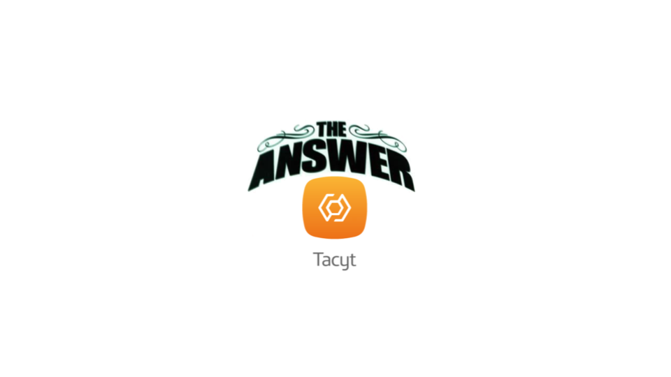
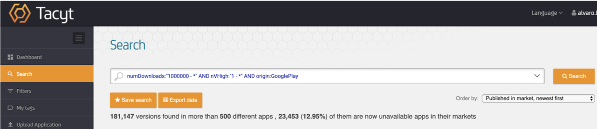

# mASAPP CI 
 

**mASAPP CI is an easy automated security check in your mobile development cycle.**

## Why

Tacyt is a big data tool that analyses and correlates millions of mobile apps and I played with some of the queries that
it permits obtaining worrying results:

The summary of this results is that the the best known markets do not contains the most safest apps :(  

mASAPP CI was born for detecting security issues before uploading the apps to the markets giving the opportunity of solving
them with a really lower costs than if this issues were discovered by third parties in production environments.

mASAPP CI is the combination of two tools:
 
 * [masappcli](masappcli/): CLI tool that upload and analyse your *.apk or *.ipa file looking for vulnerabilities and behaviors using 
 [mASAPP](https://www.elevenpaths.com/es/tecnologia/masapp/index.html) or 
 [mASAPP Online](https://www.elevenpaths.com/es/tecnologia/masapp-online/index.html).
 This tool will return an error if the analysis exceeds the ceiling previously set by you
    
 * [masappstage](masappstage/): Groovy stage template that allows you to easy start using mASAPP CI in your jenkins 
 pipeline.

## Get started!

For getting started you only need a [mASAPP](https://masapp.elevenpaths.com) account and a simple Jenkins configuration explained in 
[masappstage README.md](masappstage/README.md). If you want to use masappcli in your CLI follow this 
[documentation](https://masappci.readthedocs.io/en/master/getting_started.html)

## Learn more

* [Learn more about Tacyt](https://www.youtube.com/watch?v=dg4-y5DPnMg)                            
* [HowTo for mASAPP Online registry](https://www.youtube.com/watch?v=WatthF8tVwA)                     
* [Other mASAPP features](https://www.youtube.com/watch?v=aclSLbqoVxg) 
